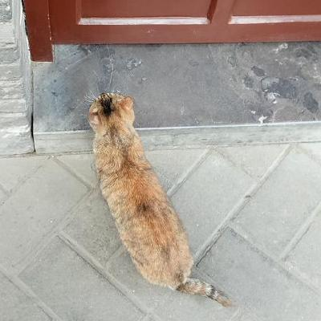

备注：写的时候注意加出处。

---

> 这里插入了一张图片。

---

# 编辑距离

> 第五组（程璐、高垚鑫、秦佳音、王可欣、孙于玲、叶璐、周慧敏）
2019年10月29日

---

# 任务分析
## 题目
## 分析
## 讨论过程
### 第一次讨论
### 第二次讨论
### 第三次讨论

---

# 编辑距离
## 概念
## 种类
## 计算的原理
## 计算方法

---

# 树结构的编辑距离计算
## 原理
## 方法

---
# 谢谢观赏！
文献列表
