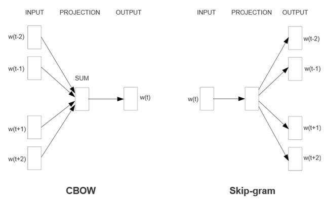
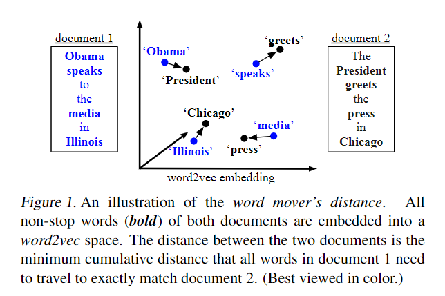
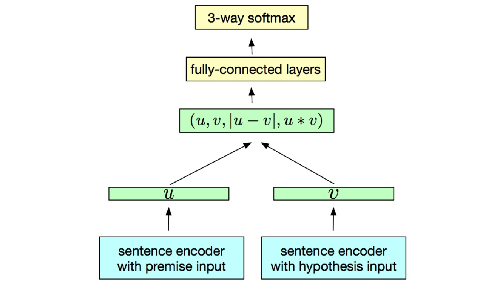
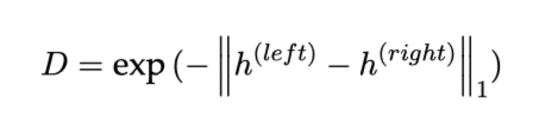
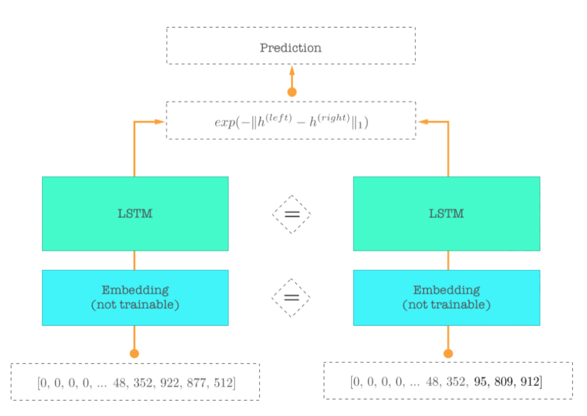

## 字符串相似度算法分类
  现有的计算字符串相似度的方法按照计算所依据的特征的不同，可以划分为3种基本方法：基于字面相似的方法、基于统计关联的方法、基于语义相似的方法，以及综合3种基本方法的多层特征方法。基于字面相似的计算方法主要有基于编辑距离的计算方法和基于相同字或词的方法。其中编辑距离法(LevenshteinDistance，LD)应用广泛，计算方法相对成熟。编辑距离指的是在两个单词之间，由其中一个单词转换为另一个单词所需要的最少单字符编辑操作次数。编辑距离又主要分成五种算法，分别是莱文斯坦距离、Damerau-Levenshtein 距离、LCS（最长公共子序列）距离、Jaro 距离和汉明距离。
  
### 莱文斯坦距离及其变种Damerau-Levenshtein 距离
莱文斯坦距离允许三种操作，分别为：插入（Insertion）、删除（Deletion）、替换（Substitution），并默认这三种操作的代价（cost）都为1。为了方便理解，我们引入代价表的概念。假设我们的源字符串为“ABFDFEGXY”，目标字符串为“ABCDEFGZ”


  
我们先看初始值，假设源字符串为空，要变化成目标字符串，则要插入目标字符的每一位，每一位相应的代价+1
  

  
假设目标字符串为空，要变化成目标字符串，则要删除源字符串的每一位，每一位的代价值+1
  

  
最后再需要对是否需要替换做出判断，如果对应字符相同则无需替换，不相同则需要替换，代价值+1。从空字符串到空字符串无需替换，因此它的初始值为0。
  
我们可以用递归的方法计算（用动态规划更能节省时间空间，但此处为方便理解，采用递归算法）
  
我们以前面字符串几位为例，讲解莱文斯坦距离是如何递归的。
  

  

  
定义leva,b(i,j)指的是a中前i个字符和b中前j个字符之间的距离。为了方便理解，这里的可以看作是的长度。这里的字符串的第一个字符 index 从 1 开始（实际因为在表上运算的时候字符串前需要补 0），因此最后的编辑距离便是a=|i|,b=的|j|时距离：leva,b(|a|,|b|)
  
当min(I,j)!=0的时候， 为如下三种情况的最小值：

1. leva,b(i-1,j)表示删除ai
2. leva,b(i,j-1)表示插入bj
3. leva,b(i-1,j-1)表示替换bj (ai!=bj)
  
我们不考虑前面的实现，至少我们确定自己这一步选择了最短的编辑距离，而你再往前推，发现左、上、左上其实都选择的是该步的最短编辑距离，这样一步步往前推，一定求得的是最短编辑距离。
  
Damerau-Levenshtein距离与莱文斯坦距离不同的是，它将相邻字符互换的代价值设置为1，即ab到ba在莱文斯坦距离中，最小编辑距离为2，1. 将a替换成b，2. 将b替换成a。而在Damerau-Levenshtein距离中，ab之间的互换算一次操作，因此两字符串之间的最小编辑距离为1。
  

  
### Damerau–Levenshtein distance（D氏距离）
#### 定义
- D氏距离是用来测量两个字符序列之间的编辑距离的字符串度量标准。两个词的Damerau-Levenshtein Distance是从一个词转换为另一个词的最少操作数，与Levenshtein Distance不同的是，除了单个字符的插入、删除和变更之外，还包括两个相邻字符的转换。[^1](https://en.wikipedia.org/wiki/Damerau%E2%80%93Levenshtein_distance)
- 对于两个字符串a、b,函数
表示a的前i个字符与b的前j个字符的编辑距离:

   当时，除了要计算Levenshtein Distance中所定义的插入、删除和变更操作的操作数以外，还要计算相邻字符转换的操作数，然后将四个操作数做对比取最小的值。并且这个操作的代价（cost)也是1。                      
#### 计算原理
- Optimal string alignment/restricted Damerau-Levenshtein distance（严格编辑距离）：
	不能往中间插入，每次只能更改串的最后一个字符（或者加入新字符或者删改原串中的最后一个字符.也就是说每次操作只能改变串A的一个位置（最后一个位置）。AC 和 CBA 的距离，若是严格编辑距离为4，则操作为：AC - CA - CB - CBA(或其他)；若是D氏距离则为3，操作为AC - CA - CBA,对于删除同理。
	代码区别举例：（增加了transposition操作）
``` 
    if i > 1 and j > 1 and a[i] = b[j-1] and a[i-1] = b[j] then
    d[i, j] := minimum(d[i, j],
                       d[i-2, j-2] + cost)  // transposition
```
- Adjacent transpositions（交换相邻项算法）
	L氏距离的求解有个性质，就是某个步骤中的操作一旦被认为是最优的，则后续的操作不会再对前面的串再做更改（再更改会使总代价变高）。即存在最优子结构。D氏距离也存在最优子结构，即移项的代价大于等于插入和删除代价和一半时，移项交换过的元素不会再被更改。也就是只需要计算当前i，j最近的一次"交叉相等"即可.（即满足交叉相等的2个下标尽可能大）由于交换需要的条件是相邻，因此，该操作需要先删除串A的所有元素再插入所有B中相应的元素，移项的代价是              , 则删除的代价是至少一次插入和删除的代价平均值


### Longest Common Substring & Longest Common Subsequence （最长公共子序列与最长公共子串）
#### 定义
- 最长公共子串问题是寻找两个或多个已知字符串最长的子串。最长公共子序列是一个在一个序列集合中（通常为两个序列）用来查找所有序列中最长子序列的问题。
- 两者区别：子串要求在原字符串中是连续的，而子序列则只需保持相对顺序，并不要求连续。例如X = {P, Q, 3, 1}; Y = {P, 3, 1, d, f}那么，{P, 3, 1}是X和Y的最长公共子序列，但不是它们的最长公共字串。
#### 实例
  给定两个序列：X[1...m]和Y[1...n]，求在两个序列中同时出现的最长子序列的长度。假设 X 和 Y 的序列如下：
X[1...m] = {A, B, C, B, D, A, B}
Y[1...n] = {B, D, C, A, B, A}
可以看出，X 和 Y 的最长公共子序列有 “BDAB”、“BCAB”、“BCBA”，即长度为4。
#### 计算原理
- 当序列的数量确定时，问题可以使用动态规划在多项式时间内解决。而动态规划具有最优子结构和重叠子问题两个特性。问题具有最优子结构性质，我们才能写出最优解的递归方程；具有重叠子问题特性，我们才能通过避免重复计算来减少运行时间。[^2](http://www.geeksforgeeks.org/dynamic-programming-set-4-longest-common-subsequence/)
- 设 C[i,j] = |LCS(x[1...i],y[1...j])|，即C[i,j]表示序列X[1...i]和Y[1...j]的最长公共子序列的长度，则C[m,n] = |LCS(x,y)|就是问题的解。
递归推导式：
从这个递归公式可以看出，问题具有最优子结构性质。
根据上面的递归推导式，可以写出求LCS长度的递归伪代码：

``` 
LCS(x,y,i,j)
	if x[i] = y[j]
		then C[i,j] ← LCS(x,y,i-1,j-1)+1
		else C[i,j] ← max{LCS(x,y,i-1,j),LCS(x,y,i,j-1)}
	return C[i,j]
```
- 像这样使用简单的递归，在最坏情况下（X 和 Y 的所有字符都不匹配，即LCS的长度为0）的时间复杂度为 θ(2n)。这和穷举法一样还是指数级的，太慢了。
根据程序中 X 和 Y 的初始值，我们画出部分递归树：
递归树中红框标记的部分被调用了两次。如果画出完整的递归树，我们会看到很多重复的调用，所以这个问题具有重叠子问题的特性。
- 简单的递归之所以和穷举法一样慢，因为在递归过程中进行了大量的重复调用。而动态规划就是要解决这个问题，通过用一个表来保存子问题的结果，避免重复的计算，以空间换时间。前面我们已经证明，最长公共子序列问题具有动态规划所要求的两个特性，所以 LCS 问题可以用动态规划来求解。
下面是用动态规划（打表）解决LCS问题：

  所以动态规划解决LCS问题的时间复杂度为θ(mn)，这比简单的递归实现要快多了。空间复杂度是θ(mn)，因为使用了一个动态规划表。
> 动态规划将原来具有指数级时间复杂度的搜索算法改进成了具有多项式时间复杂度的算法。其中的关键在于解决冗余（重复计算），这是动态规划算法的根本目的。
动态规划实质上是一种以空间换时间的技术，它在实现的过程中，不得不存储产生过程中的各种状态，所以它的空间复杂度要大于其它的算法。
综上所述，动态规划的关键是——记忆，空间换时间，不重复求解，从较小问题解逐步决策，构造较大问题的解。

## 汉明距离
### 定义
两个等长字符串之间的汉明距离（Hamming distance）是两个字符串对应二进制位不同的位置的数目。换句话说，它就是将一个字符串变换成另外一个字符串所需要替换的字符个数。
例如：
1011101与1001001之间的汉明距离是2。
2143896与2233796之间的汉明距离是3。
"toned"与"roses"之间的汉明距离是3。

汉明重量是字符串相对于同样长度的零字符串的汉明距离，也就是说，它是字符串中非零的元素个数：对于二进制字符串来说，就是 1 的个数，所以 11101 的汉明重量是 4。

### 计算原理
对于二进制字符串a与b来说，它等于a 异或b以后所得二进制字符串中“1”的个数。

### 最小汉明距离
在一个码组集合中，任意两个码字之间对应位上码元取值不同的位的数目定义为这两个码字之间的汉明距离。即
d(x,y)=∑x[i]⊕y[i]
这里i=0,1,..n-1，x,y都是n位的编码，⊕表示异或

例如：(00)与(01)的距离是1，(110)和(101)的距离是2。在一个码组集合中，任意两个编码之间汉明距离的最小值称为这个码组的最小汉明距离。最小汉明距离越大，码组越具有抗干扰能力。

下面我们用d表示码组的最小汉明距离。
1． 当码组用于检测错误时，设可检测e个位的错误，则d>=e+1
　　设有两个距离为d的码字A和B，如果A出现了e个错误，则A变成了以A为圆心，e位半径的球体表面的码字。为了能够准确地分辨出这些码字既不是A也不是B，那么A误码后变成的球面上的点与B至少应该有一位距离（如果B在球面上或在球面内部则无法分辨出到底B是不是A的错误码），即A与B之间的最小距离d>=e+1。
2． 若码组用于纠错，设可纠错t个位的错误，则d>=2t+1
设有码字A和B，如果A出现了t个错误，B也出现了t各错误，则A码变成以A为圆心，t为半径的球面上的码字；B码变成以B为圆心，t为半径的球面上的码字。为了在出现t个错之后仍能分辨一个码字到底是属于A的错码还是属于B的错码，A,B为球心的两个球面应该不相交，即球心A，B之间距离应该大于2t，所以d>=2t+1。
3.如果码组用于纠正t个错，检测e个错，则d>=e+t+1
这里e>t，这种检错纠错方式结合的情况同上述两个情况类似。当码字出现t个或者小于t个错时，系统按照纠错方式工作。当码字出现超过t个错而小于等于e个错时，系统按照检错方式工作；当A出现e个错，B出现t个错时，既要纠正B的错，又要发现A的错，则以A为球心，e为半径的球和以B为球心，t为半径的球应该不相交，所以A,B之间的距离应该大于等于e+t+1，即d>=e+t+1。

汉明距离在包括信息论、编码理论、密码学等领域都有应用。但是，如果要比较两个不同长度的字符串，不仅要进行替换，而且要进行插入与删除的运算，在这种场合下，通常使用更加复杂的编辑距离等算法。

## Jaro距离
### 定义
Jaro distance（又称Jaro similarity）,这是由Matthew A. Jaro在1989年提出的计算2个字符串之间相似度的算法，而Jaro-Winkler distance是由William E. Winkler在Jaro distance的基础上进一步改进的算法, 适合于名字这样较短的字符之间计算相似度。

### Jaro distance/similarity
对于两个字符串s1和s2，它们的Jaro 相似度由下面公式给出：


其中：
- ①|s1|和|s2|表示字符串s1和s2的长度。
- ②m表示两字符串的匹配字符数。
- ③t表示换位数目transpositions的一半。

### 匹配窗口(Matching Window，MW)

Jaro算法的字符之间的比较是限定在一个范围内的，这个范围就是匹配窗口。它是一个阈值，在这个阈值之内两个字符相等，可以认为匹配；超过这个阈值，即使存在另一个字符与该字符相等，但由于距离太远，二者的相关性太低，不能认为它们匹配。

在Jaro算法中，它被定义为不超过下面表达式的值：
 

 
对于两个字符串s1和s2，它们的Jaro 相似度由下面公式给出：
 
其中：
- ①|s1|和|s2|表示字符串s1和s2的长度。
- ②m表示两字符串的匹配字符数。
- ③t表示换位数目transpositions的一半。

#### 举例

字符串A(bacde)和字符串B(“abed”)，匹配窗口大小为1，字符‘a’、‘b’、‘d’都是匹配的，indexInA(‘d’) = 3，indexInB(‘d’) = 3，二者的距离是0，小于匹配窗口大小。但对于‘e’，虽然两字符串都有‘e’这个字符，但它们却是不匹配的，因为‘e’的下标分别为4和2，距离为2 > mw。

在这个例子中，由于有3个字符匹配，因此m = 3。换位数目表示不同顺序的匹配字符的个数。同样看这个例子，‘a’和‘b’都是匹配的，但‘a’和‘b’在两个字符串的表示为"ba…“和"ab…”，它们的顺序不同，因此这里换位数目transpositions = 2，而t = transpositions / 2 = 1。

对于任意字符串A和B，能求出它们的length、m和t，这样便能代入公式求得二者的相似度(Jaro similarity)。从刚才的例子得到，|s1|=5，|s2|=4，m=3，t=1，代入公式可得：simj = (3/5 + 3/4 + (3-1)/3)/3 = 0.672


### Jaro-Winkler distance/similarity

Jaro-Winkler similarity是在Jaro similarity的基础上做的进一步修改，在该算法中，更加突出了前缀相同的重要性，即如果两个字符串在前几个字符都相同的情况下，它们会获得更高的相似性。该算法的公式如下：
 

 
其中：
- ①simj 就是刚才求得的Jaro similarity。
- ②L表示两个字符串的共同前缀字符的个数，最大不超过4个。
- ③p是缩放因子常量，它描述的是共同前缀对于相似度的贡献，p越大，表示共同前缀权重越大，最大不超过0.25。p默认取值是0.1。

#### 图解Jaro-Winkler similarity求解过程

还是以字符串A(“abcdefgh”)和字符串B(“abehc”)为例，来介绍整个算法的流程。这里以短字符串为列元素，长字符串为行元素，建立(|s1|+1)×(|s2|+1)的矩阵，这里匹配窗口的大小为3(注意包括距离为0的匹配)，然后根据公式不断运算：


 
**总结求解过程：**串s1作为行元素，字符串s2作为列元素，窗口大小为mw，同时建立两个布尔型数组，大小分别为s1和s2的长度，布尔型数组对应下标的值True表示已匹配，false表示不匹配。

对于行元素的每一个字符c1，根据c1在该字符串s1中的下标k，定位到s2的k位置，然后在该位置往前遍历mw个单位，往后遍历mw个单位，如果寻找到相等的字符，记在s2中的下标为p。经过这样的一次遍历，找到了k和p，分别标记布尔型数组s1的k和布尔型数组s2的p为已匹配(true)，下次遍历时就跳过该已匹配的字符。当对s1的所有元素都遍历完毕时，就找到了所有已匹配的字符，统计已匹配的字符便能得到m，然后对两个布尔型数组同时按照顺序比较，如果出现了true，但二者对应字符串相应位置的字符不相等，表示这是非顺序的匹配，这样就可以得到t。这样就能根据m和t求出Jaro similarity了。至于Jaro-Winkler similarity，需要p参数，即求出俩字符串最大共同前缀的大小。

上面的过程关键就在于判断来自俩字符串的相等字符的距离是不是超过了阈值(即匹配窗口长度)。这里的判断方法是在某个位置进行前后的搜索，包括当前位置。

我们来看下面的一组实验结果：
 

 
关键字是fox，另外的字符串是包含有fox几个字符的字符串，可以看出最高相似度的是"fox"在开始几位的情况下，而"afoxbcd"反而比"foaxbcd"更低，虽然前者含有完整的"fox"而后者是分开的。同时"abcdfox"的相似度为0，即使末尾含有"fox"。

上面这几个例子说明了jaro-winkler相似度对于前缀匹配更友好，并且越往前面匹配成功带来的权重更大。由此可以看出，该算法可以用在单词的匹配上，比如对于一个单词"appropriate"，找出数据库中与它最匹配的一个词语，可以是"appropriation"，也可以是"appropriately"等。但是，该算法不适用在句子匹配上，因为如果关键字在句子的后面部分，相似度会急剧下降，甚至为0。


## 编辑距离

## BK树
### 介绍
BK树（Burkhard Keller Tree）的概念最早由W.A.Burkhard和R.M. Keller于1972年提出。这种树结构可以根据Levenshtein编辑距离概念进行拼写检查、字符串模糊匹配。许多软件中的自动校正功能都可以基于BK树结构完成。[^1].

### 基本理论
BK树最早提出时是为了解决如何在文件中查找与查询关键码（key）最相近的key的问题。[^2]

**情景：**
假设有一文件X，其中所有的成员都已被编入索引，再假设有一个极大可能不在X文件中的查询单元q，应该采取什么样的办法在X中得到与q最相近的单元？
- Exahaustive search technique:对X中的每个元素逐一进行检查必然是一种可行方法。但当文件过大时，会在查询过程中耗费巨大时间成本。
- Binary search：使用二分法进行检索需要建立在X中文件的key可以进行排序的前提之上。
- BK树检索

**建树：**
bk树的建立基于Levenshtein编辑距离概念，定义d(x,y)为key x到key y的编辑距离。此外若有另一key z，则有如下性质成立：
- d(x,y)=0 #编辑距离为0，意为x=y
- d(x,y)=d(y,x)  #从x变到y的最少步数就是从y变到x的最少步数
- d(x,z)<=d(x,y)+d(y,z) #从x变到z所需的步数不会超过x先变成y再变成z的步数
其中第三点性质最为重要，由于和数学中的三角形不式（两边之和大于第三边）相似，被称作编辑距离中的三角不等式。

任意在X中选取元素x0作为根节点建树，基于d(x0,x)的值划分成X的子集X1,X2...而X1,X2...的节点将继续根据d(x00,x1),d(x10,x2)...的规律划分，更下层的节点通过同样的方法递归进行划分，直到X中所有元素被记录在以x0为根节点的BK树中。
 BK树最早提出时的图例

### 应用
#### 模糊匹配与错误纠正
##### 模糊匹配
在查找最相近字符串的基础上，很快有人提出如何利用BK树进行模糊匹配的问题。[^3]

**情景：**
假设有一个字符集合S，一个长度相对较短的字符串模式q,希望返回所有与q最大编辑距离在k之内的所有结果（即所有d(q,x)<=k的结果）。
模糊字符串匹配最先出现于1992年，主要分为两种：
1. Word-oriented： 基于自然语言、信息获取，算法可以获取于q模式最接近的，精确到词层面的结果。
2. Sequence-oriented：此种匹配适用于并不是自然语言的文本，返回结果并非以词划分，而是字符序列。

此处讨论的是第一种基于词汇划分的模糊匹配：
- 传统使用动态规划方法，详细见前文有关动态规划内容。但这种方法有所局限：不适用于搜索文本过大，或者加入不确定性的搜索。
- BK树匹配：减少搜索次数，提高效率。

**实现：**
与常规词汇存储方法不同（一般采用倒排索引方法：单独存储文本中所有词汇以及词频），采用BK树方式任意挑选S集合中一个词汇a作为根节点建树，子树以不同整形值进行划分，并向下递归，直到S中所有的元素都包含在以a为根节点的树中。子节点i意为i节点中的元素与根节点a的编辑距离。
根据三角不等式，对于存储在i节点上的x来说有如下关系：
- d(a,q)-k<=i<=d(a,q)+k


不符合如上关系的树枝将被丢弃，不再查找，因此大大减少了时间上的开销。继续从符合要求的节点向其子节点以同样的方式递归，最终稿返回所有S集合中符合d(q,x)<=k条件的x。

此外，这种搜索结构受词汇前缀的影响很小的同时对文本本身有较大的容错度，支持返回模糊匹配和精确匹配两种需求。[^3]

##### 错误纠正
传统动态规划的算法由于可以满足移位、加权等应用拥有很大的灵活性，但BK树有独特的适合它的应用场景，比如在错误查询和纠正上。
这种使用方法其实与模糊字符串匹配相近，将两个词的编辑距离看作“错误”（例如：编辑距离为0的两个词之间错误为0，编辑距离为2的两个词之间错误为2）。
BK树是多路查找树，并且是不规则的（但通常是平衡的）。BK树的查找时间一般以公式O(n*m*n)衡量，其中n代表字典中词汇总量，m代表正确词汇的平均大小，n为错误单词的长度。Ricardo Baeza-Yates的论文中阐释道，当错误为1时，搜索只需遍历全树的5-8%；错误为2时，需要遍历全树的17%-25%。[^3]如果要进行精确查找，也可以非常简单地将k设置为0进行。

### 简单实例
假设现在有一个字典dict，其中包含GAME,FAME,GAIN,AIM,几个元素，随机选择GAME作为根节点。插入单词FAME，根据Levenshtein编辑距离概念，它与GAME的距离为1，于是建立一个与GAME编辑距离为1的子节点。插入单词GAIN，它与GAME的距离为2，于是建立一个与GAME编辑距离为2的子节点。同样，为AIM建立一个编辑距离为3的子节点。[^5]

BK树中的每个节点都只有一个具有相同编辑距离的子节点。在发生冲突时，向下继续寻找，直到找到字符串节点的适当父节点。[^4]溜当插入GATE时，算得它与GAME距离也为1，与FAME相同，于是沿着那条编号为1的子节点向下查找，递归地插入到FAME所在子树。

下图为以GAME为根节点的，拥有FAME,GAIN,AIM,SAME,GATE,GAY,FRAME,ACM,HOME几个元素的BK树：


**情景：**
假如输入单词GAIE，程序发现它不在字典dict中，需要返回字典中所有与GAIE距离为1的单词。

步骤：

1. BK树中所有的查询都必须从根节点开始。GAIE一词与根节点GAME的编辑距离为1，输出GAME。根据编辑距离三角不等式定理，此时只需在编辑距离范围在[1,2]（d(a,q)-k<=i<=d(a,q)+k）之间的节点查询并继续向下迭代即可。则此例不再寻找单词AIM所在分支以下的所有词汇。（由于以AIM为根的子树到GAME的编辑距离时3，而GAME和GAIE之间的编辑距离是1，那么AIM及其子树到GAIE的编辑距离至少都是2）此例字典中词汇较少，仅排除一支，但依旧可想当样本过大时，会裁剪掉相当大一部分的分支，减少计算次数。
2. 在符合条件的子节点上继续查找，方法与之前完全相同：1）判断父节点到查询词汇GAIE的编辑距离2）通过三角不等式进行排除3）输出编辑距离小于查询要求的结果（此处为1）4）直到所有符合要求节点遍历完成。
   
   例如继续计算与GAME编辑距离为2的GAIN线，父节点GAIN与查询单元GAIE的编辑距离为1，输出GAIN。根据三角不等式排除编辑距离再[1,2]之外的其他节点——这里FRAME分支被排除，继续沿编号为1或2的边递归下去……


[^1]: <https://www.geeksforgeeks.org/bk-tree-introduction-implementation/> 
[^2]: bk tree
[^3]: fast approxiate string
[^4]:<https://www.jianshu.com/p/cedbd94f4f45>
[^5]:<http://www.matrix67.com/blog/archives/333>

#### 实现（可能要加代码）


## 一个例子讲解

（要不代码加到这里）

## 句相似度计算（可欣）
### 相似度检测方法
用于计算两句子间语义相似度的方法非常广泛，下面是常见的几种方法。

在自然语言处理中，文本相似度是一个很重要的领域，并且其商业应用也很广阔，包括文本检索、新闻分类与聚类 、歌曲识别、多语言文档匹配等，都可以用文本相似度来评判。在自然语言处理中，文本相似度是一个很重要的领域，并且其商业应用也很广阔，包括文本检索、新闻分类与聚类 、歌曲识别、多语言文档匹配等，都可以用文本相似度来评判。主要有以下几种：

#### 1. BOW
BOW全名叫Bag of words，也称为词袋模型，在信息检索中，BOW假定对于一个文本，忽略其词序和语法，句法，将其仅仅看做是一个词集合，或者说是词的一个组合，文本中每个词的出现都是独立的，不依赖于其他词 是否出现，或者说当这篇文章的作者在任意一个位置选择一个词汇都不受前面句子的影响而独立选择的。在文本相似度中，词袋模型是将两篇文本通过词袋模型变为向量模型，通过计算向量的余弦距离来计算两个文本间的相似度。但这有个明显的缺点，就是严重缺乏相似词之间的表达。比如“我喜欢足球”和“我不喜欢足球”这两个文本是严重不相似的，但词袋模型会判为高度相似。再比如“我喜欢足球”和“我热爱足球”的意思是非常的接近的，但词袋模型不能表示“喜欢”和“爱”之间严重的相似关系。

#### 2. TF-IDF
TF-IDF的全称是term frequency–inverse document frequency，翻译为词频-逆向文件频率。TF-IDF的主要思想是：如果某个单词在一篇文章中出现的频率TF高，并且在其他文章中很少出现，则认为此词或者短语具有很好的类别区分能力，适合用来分类。
   
#### 3. Word2Vec 
Word2Vec是一种将文本中的词进行嵌入的方法，而所谓嵌入，就是将各个词使用一个定长的向量来表示。word2vec工具主要包含两个模型：连续词袋模型（continuous bag of words，简称CBOW）和跳字模型（skip-gram），word2vec词向量可以较好地表达不同词之间的相似和类比关系。 


左边是CBOW模型，它的目标是：给定一串文本，使用某个词的上下文来预测这个词。例如，对于句子“Old soldiers never die，they just fade away”，预测soldiers这个词时，可以使用never、die、fade、away这四个词，它们构成了soldiers的上下文。这样，从文本中就可以提取一系列的训练样本。得到上下文以后，将这些词的one-hot编码累加起来，输入神经网络，然后神经网络进行一些变换，其目标为得到fox这个词的one-hot编码。训练好之后的神经网络中，隐藏层的权重矩阵就是词嵌入后的向量了。
右边的skip-gram是类似的，它输入当前词soldiers，目标是变换为上下文的词汇，此处上下文词汇的处理与CBOW一样，也是将这些词的one-hot编码相加，作为训练使用的真值。
由上面的简单介绍可以了解到，将文本用word2vec模型进行训练，得出的词向量是具有词与词之关系的，语义关系会保存在词向量的运算中。这是之前提到的两种模型不具备的。
   
#### 4.  词移距离
词移距离（Word Mover’s Distance）。 利用word2vec嵌入的这个保存语义关系的属性。将文本文档表示为嵌入单词的加权点云。两个文本文档A和B之间的距离是文档A中的单词精确匹配文档B的点云所需要经过的最小累计距离。 词移距离使用两文本间的词嵌入，测量其中一文本中的单词在语义空间中移动到另一文本单词所需要的最短距离。 WMD的模型基于EMD（Earth Mover Distance）模型。EMD和欧式距离一样，它们都是一种距离度量的定义、可以用来测量某两个分布之间的距离。 （参考： From Word Embeddings To Document Distances ）
 
 
#### 5. Smooth Inverse Frequency
从语义上来讲，求一句话中词嵌入的平均值似乎给与不相关的单词太多权重了。而Smooth Inverse Frequency试着用两种方法解决这一问题：
- 加权：就像上文用的TF-IDF，SIF取句中词嵌入的平均权重。每个词嵌入都由a/(a + p(w))进行加权，其中a的值经常被设置为0.01，而p(w)是词语在语料中预计出现的频率。
- 常见元素删除：接下来，SIF计算了句子的嵌入中最重要的元素。然后它减去这些句子嵌入中的主要成分。这就可以删除与频率和句法有关的变量，他们和语义的联系不大。
- 最后，SIF使一些不重要的词语的权重下降，例如but、just等，同时保留对语义贡献较大的信息。
   
#### 6. 预训练编码器
WMD模型和SIF模型具有两个重要的特征：首先，作为简单的词袋方法，它们并不考虑单词的顺序。其次，它们使用的词嵌入是在一种无监督方法中学习到的。这两种特点都有潜在的威胁。由于不同的词语顺序会有不同的意思（例如“the dog bites the man”和“the man bites the dog”），我们想让句子的嵌入对这一变化有所反馈。另外，监督训练可以更直接地帮助句子嵌入学习到句意。
于是就出现了预训练编码器。预训练的句子编码器的目的是充当word2vec和GloVe的作用，但是对于句子嵌入来说：它们生成的嵌入可以用在多种应用中，例如文本分类、近似文本检测等等。一般来说，编码器在许多监督和非监督的任务中训练，目的就是能尽量多地获取通用语义信息。目前已经有好几款这样的编码器了，我们以InferSent和谷歌语句编码器为例。
 
InferSent是由Facebook研发的预训练编码器，它是一个拥有最大池化的BiLSTM，在SNLI数据集上训练，该数据集含有57万英语句子对，所有句子都属于三个类别的其中一种：推导关系、矛盾关系、中立关系。

#### 7. 基于LSTM的语句相似度计算方法
Siamese Network 是指⽹络中包含两个或以上完全相同的⼦⽹络，多应 ⽤于语句相似度计算、⼈脸匹配、签名鉴别等任务上：
 
  以语句相似度计算为例，两边的⼦⽹络从 Embedding 层到 LSTM 层等 都是完全相同的，整个模型称作 MaLSTM（ManhaĴan LSTM）。
通过 LSTM 层的最后输出得到两句话的固定长度表⽰，再使⽤以下公式 计算两者的相似度，相似度在 0 ⾄ 1 之间。
 
下图是整个网络大致的过程，左右两个句子输入后，句子中的每个词对应一个数字，左右两句话分别映射成一个向量，各自经过一个LSTM网络抽取特征后，使用曼哈顿距离计算两边向量的差距，最终得出预测结果。
 
参考：https://github.com/eliorc/Medium/blob/master/MaLSTM.ipynb
## 树结构 （Humi）
### 语言学中的句法学

#### 乔姆斯基的转换生成语法

   诺姆·乔姆斯基（Noam Chomsky）在20世纪50年代提出了转换生成语法（transformational-generative），在语言学领域掀起了一场革命。

   

   ##### 句子的表层结构和深层结构

   - 表层结构：一个句子实际表现出的句法形式
   - 深层结构：一个句子深层次的抽象的结构组合，包括决定该句子的结构取向的全部要素。

   

   ##### 转换生成语法的四大特点：

   - 转换生成语法应该能够生成语言中所有合乎句法规则的句子，而且只生成合乎句法规则的句子。

     就是所有句子都应满足转换生成语法。

   - 能够运用有限的规则生成无限的合乎规则的句子。

     这样，转换生成语法才能解释语言的创造性

   - 在生成句子时应该能够被重复使用，这称为循环性。

     解释语言的无穷性。

   - 还应能解释另外三种语言现象：

     - 为何有些表层结构差异很大句子却紧密联系？

       eg: 主动语态与被动语态的问题

       He broke the vase.

       The vase was broken by him.

       这两个句子的表层结构看起来非常不同，但是深层结构却是一样的。

     

     - 有些表层结构看起来相似句子，意思却大相径庭?

       eg：

       Tom is easy to please.

       Tom is eager to please.

       这两个句子的表层结构看起来几乎一样，但是仔细分析就会发现，第一个句子Tom是动作的承受者，而第二个句子中，Tom是动作的发出者，意思截然不同，深层结构也不同。

       

     - 需要解释结构歧义。

       eg:

       old woman and man

       old到底是修饰woman，然后和man并列还是old同时修饰woman和man？

   

   

#### 转换生成语法中的句子结构

   ##### 短语结构

     短语结构是一个句法概念。可由一个或一个以上的词组成，无论哪一类，都必须含词组名称所表示的词。

     - 名词词组（NP）：the pretty girl
     - 动词词组（VP）：often dream
     - 介词词组（PP）：very happy
     - 形容词词组（AP）：mainly about

     名词词组和动词词组是句子中最主要的短语结构。

   ##### 句子（the S rule)

     S--NP VP


### 计算机自然语言处理中的句子处理
#### 语义层面的相似计算

以下选自论文：

Yuhua Li, Zuhair Bandar, David McLean and James O’Shea  A Method for Measuring Sentence Similarity and its Application to Conversational Agents 

句子由词组成，所以在比较句子相似性时，可以先将句子分词。

....

T1={w1, W2, ..., Wn},

T2={v1,v2,...，Vm}

那么1和2中出现的所有词的集合就是

T=TI U T2 = {q1, q2, ..., qk}

... 


eg: 

T1: RAM keeps things being worked with.

T2:The CPU uses RAM as a short-term memory store.

T={RAM keeps things being worked with The CPU uses as a short-term memory store }


词语语义向量用š表示

语义向量的每个条目对应单词集中的每个单词，因此维度相当于单词集中单词数量。

词语语义向量的值 ši(i=1,2,...,m), 由相似单词与句子中单词的语义相似度决定。

Case 1: If wi appears in the sentence, ši is set to 1. 
Case 2: If wi is not contained in T1, a semantic similarity score is computed between wi 
and each word in the sentence T1, 
Thus the most similar word in T1 to wi  is that with the highest similarity score 
ς.  If ς exceeds a preset threshold, then ši = ς, otherwise ši = 0


#### 涉及到语序问题


Zhao Jingling，Zhang Huiyun, Cui Baojiang,Sentence Similarity Based on Semantic Vector Model 

有些句子所包含的词语完全相同，但是由于句子语序影响，表达出的意思完全不同。

T1：椅子的右边是一桌子；

T2：桌子的右边是一椅子；

T={椅子，的，右边，是，一，桌子}

我们可以根据字符在序列中的索引得出

r1={1,2,3,4,5,6}

r2={6,2,3,4,5,1}


可以看出这两个句子所表达的意思是不一样的，但如果只从语义角度计算，那相似度就是一样的。因此在计算句子相似度时还需要考虑语序问题，目前查到的论文中提出了以下这种计算两个句子之间语序相似度的。


#### 句子相似度整体计算

结合上面两个方面，句子相似度既要考虑到语义层面还要考虑到句子语序问题。


T1:  My little boy loves baking cakes. 

T2:  All girls like to bake cakes. 

T3:  Girls like going to cake-bakes. 

T4:  Some boys enjoy baking cakes. 

T5:  When I was a boy I occasionally baked cakes. 

T6:  This little baked cake is inedible.

T7:  Skidding cars bake my cakes every time. 

T8:  On the little hill it was baking hot and the boy was caked in mud.


## 树结构和翻译记忆的关系

